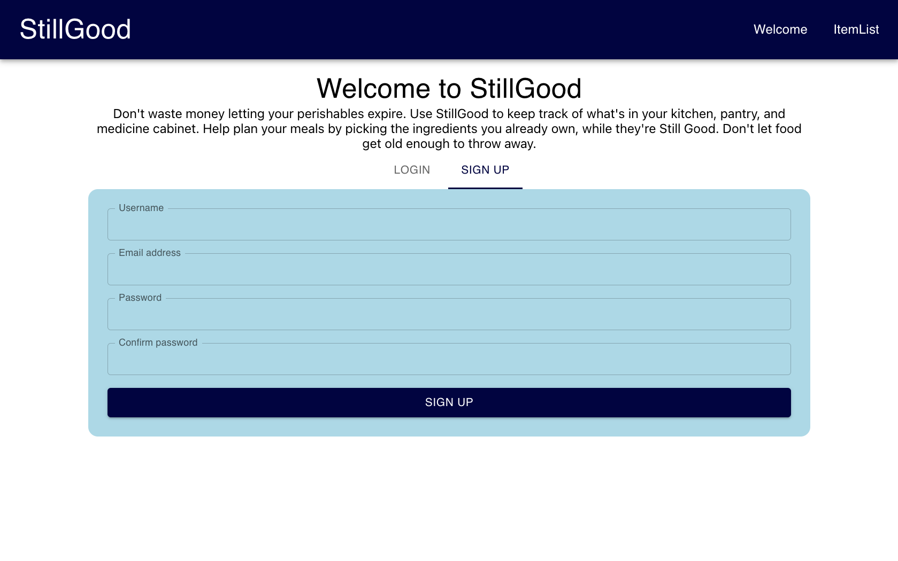
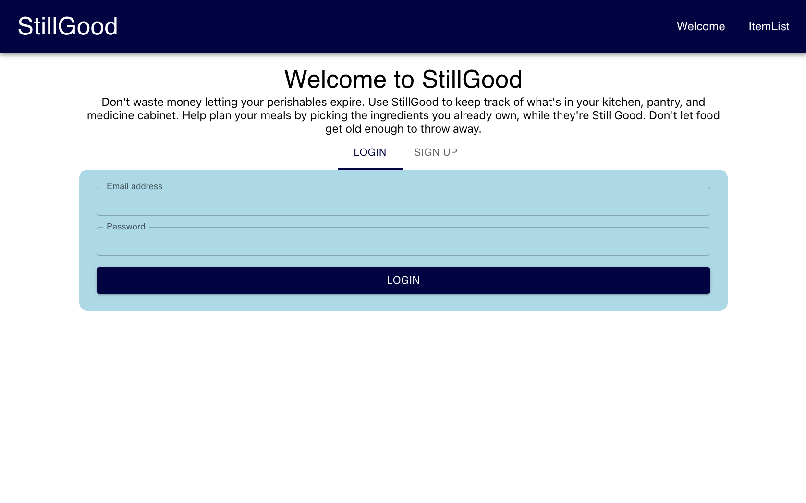
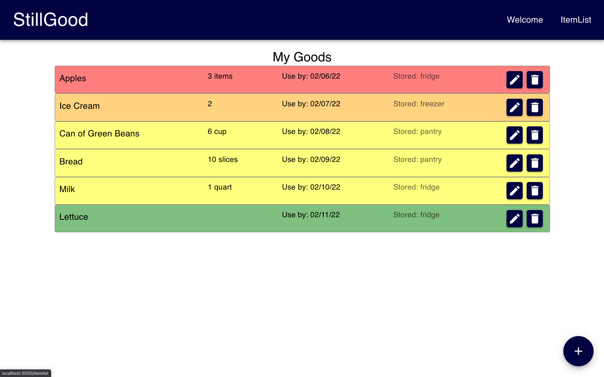
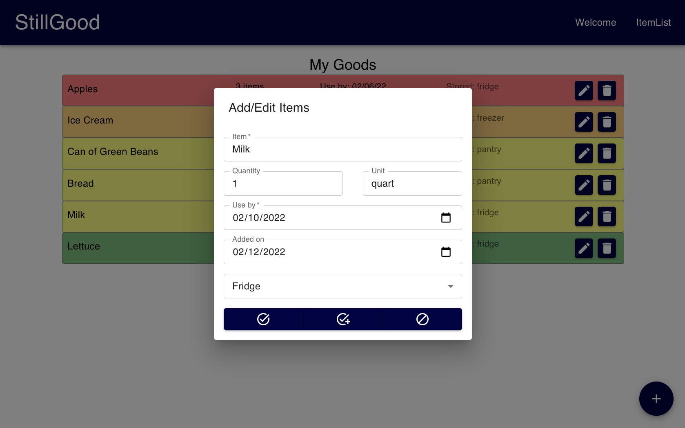

# Still Good

## Table of Contents 
* [Description](#description)
* [Instructions](#instructions)
* [Technologies Utilized](#technologies-utilized)
* [Contributions](#contributions)
* [Questions](#questions)
* [Future Features](#future-features)
* [Collaboration Requests](#collaboration-requests)

## Description

Still Good is a product tracking tool, designed to remedy your wasteful habits or curate your existing flow of perishable items. The idea is to support budget-conscious or waste-conscious people in their missions to move products from store to consumed by the expiration dates.

**Project Requirements:**
* Use React for the front end.

* Use GraphQL with a Node.js and Express.js server.

* Use MongoDB and the Mongoose ODM for the database.

* Use queries and mutations for retrieving, adding, updating, and deleting data.

* Be deployed using Heroku (with data).

* Have a polished UI.

* Be responsive.

* Be interactive (i.e., accept and respond to user input).

* Include authentication (JWT).

* Protect sensitive API key information on the server.

* Have a clean repository that meets quality coding standards (file structure, naming conventions, best practices for class and id naming conventions, indentation, high-quality comments, etc.).

* Have a high-quality README (with unique name, description, technologies used, screenshot, and link to deployed application).

**View the application, here:** [Still-Good](https://pacific-bayou-24755.herokuapp.com/)

## Instructions 

| 1. New users can sign up with username/email/password | 2. Returning users can log in with the same email/password |
| :-- | :-- |
|  |  |

| 3. Once logged in, users will be taken to the "Item List" page where a list of their items is stored |
| :-- |
|  |

|5. Edit or delete items on the list | 6. Add new items to the list |
| :-- | :-- |
|  |  |

## Technologies Utilized
 
 * MongoDB
 * Express.js
 * React.js
 * Node.js
 * MaterialUI
 * GraphQL
 * JavaScript
 * Mongoose
 * Apollo Server Express
 * JSON Web Token
 * Bcrypt
 * Day.js
 * React Router Dom
 * HTML
 * CSS

## Contributions

**Victor Weinert** 
- project management (role assignments, scheduling), frontend, schema design, GraphQL (connecting frontend to backend), Heroku deployment, testing, bug fixes

**Patrick Sebstead** 
- Backend, testing, bug fixes

**TJ James**
- Frontend, initial project setup, UI design, validation, testing, bug fixes

**Melvin Welton** 
- Backend, testing, bug fixes

**Alex McDaniel** 
- Backend lead, testing, bug fixes

**Lauren Groh** 
- Frontend, initial models & associations, validation, mutations, README, PPT slideshow, validation, mutations

## Questions

If you have any questions, feel free to connect with us through Github: 

* [Victor Weinert](https://github.com/vw0389)
* [Patrick Sebstead](https://github.com/RaiderNationBuilder)
* [TJ James](https://github.com/jamestw13)
* [Melvin Welton](https://github.com/melwel74)
* [Alex McDaniel](https://github.com/alexm1937)
* [Lauren Groh](https://github.com/GrohTech)

## Future Features
1. Create desktop version
2. Tie in other food APIs so users can search for existing products
3. Set up reminders/notifications
4. Implement food safety pop ups/notes
5. Add weekly or monthly calendar view
6. Add barcode scanning API

## Collaboration Requests

If you'd like to help implement any of these future features, please get in touch with one of [us](#contributions). 
To test out our project and come up with ideas to propose, follow the instructions, below:  

**Fork repository:**  
```
Click "Fork"
```

**Clone forked repository:**
```
git clone <repository link>
```

**Add npm dependencies:**
```
npm install
```
**Seed database:**
```
npm run seed
```
**Start servers:**
```
npm run develop
```
